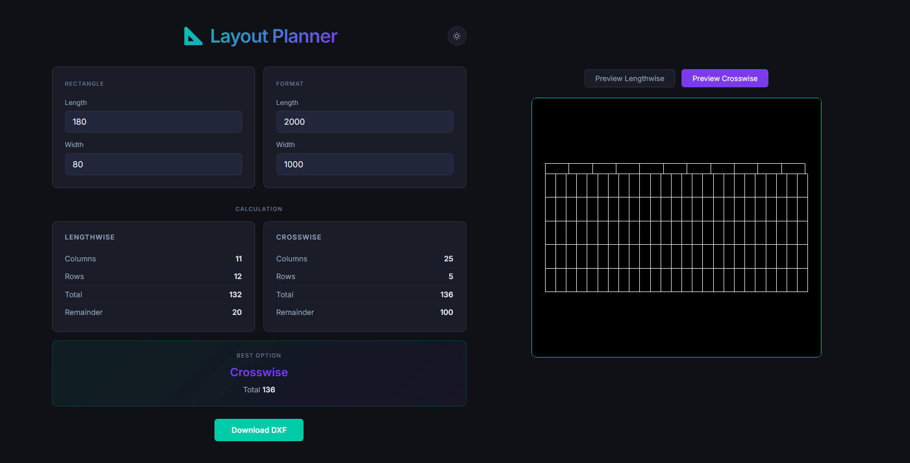

# 📐 Layout Planner


A fast, browser-based tool for calculating how many rectangular pieces fit on a larger sheet — and instantly exporting the result as a DXF file for CAD or cutting software.

Useful for **print shops, packaging designers, sign makers, laser cutters, CNC operators,** and anyone who needs to optimise material yield from a sheet or roll.

🌐 **Live Demo:** [layout-planner.netlify.app](https://layout-planner.netlify.app)

---

## What it does

You enter two sets of dimensions:

| Input | Example |
|---|---|
| **Piece** (what you're cutting) | 100 × 70 mm label |
| **Sheet** (the material you have) | 1000 × 700 mm stock |

Layout Planner instantly calculates both possible orientations:

- **Lengthwise** — piece placed with its long side along the sheet's length
- **Crosswise** — piece rotated 90°

For each orientation it shows columns, rows, total pieces, and whether any extra pieces fit in the leftover strip. It highlights the **best option** automatically, no guessing required.

---

## Features

- **Dual-orientation calculation** — both rotations compared side by side
- **Remainder strip optimisation** — squeezes extra pieces from leftover material
- **DXF export** — download a ready-to-use layout file for CAD or cutting software
- **Inline DXF preview** — see the exact layout before you download
- **Dark / light theme** — persisted in `localStorage`
- **Runs entirely in the browser** — no server, no account, no upload of your data

---

## Getting started

**Requirements:** Node.js 18+

```bash
git clone https://github.com/rekcoob/layout_planner.git
cd layout-planner
npm install
npm run dev        # opens at http://localhost:5173
```

Other commands:

```bash
npm run build      # type-check + production build
npm run preview    # preview the production build locally
npm run lint       # ESLint
```

---

## How to use

1. Enter your **piece dimensions** (length × width)
2. Enter your **sheet dimensions** (length × width)
3. Results update instantly — no button to press
4. Click **Preview** to render the layout inline
5. Click **Download DXF** to export the best-fit layout

---

## Tech stack

| Layer | Technology |
|---|---|
| Framework | React 18 + TypeScript |
| Build tool | Vite |
| DXF generation | [`dxf-writer`](https://github.com/tarikjabiri/dxf) |
| DXF rendering | [`dxf-viewer`](https://github.com/vagran/dxf-viewer) |
| Styling | CSS Modules + CSS custom properties |

---

## Project structure

```
src/
├── context/        # AppContext — single source of truth for all four dimensions
├── hooks/          # useTheme, useCalculatedLayout, useDxfContent
├── utils/          # calculateLayout.ts (pure math), drawDxf.ts, downloadBlob.ts
└── components/     # InputForm, Results, DownloadDxfButton, PreviewDxfButtons, ThemeToggle
```

The calculation logic lives entirely in `src/utils/calculateLayout.ts` — pure TypeScript, no side effects, easy to test and extend.

---

## Contributing

Issues and pull requests are welcome. If you work in an industry where material efficiency matters, your real-world feedback is especially valuable.

---

## License

MIT
